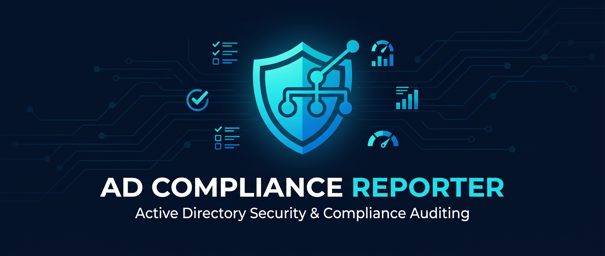
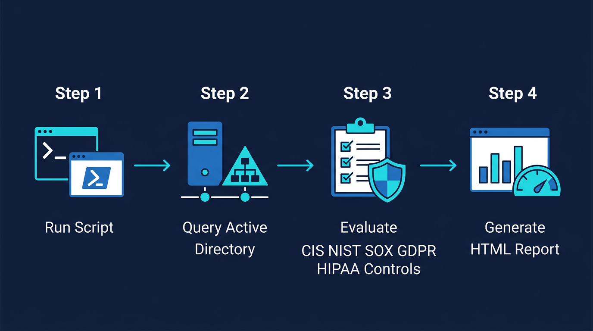
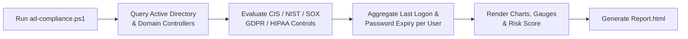

<div align="center">



# 🛡️ AD Compliance Reporter

[](https://git.io/typing-svg)


**Keywords:** `active-directory` · `powershell` · `security-compliance` · `cis-benchmark` · `nist` · `gdpr` · `hipaa` · `sox` · `audit-report` · `sysadmin-tools` · `blue-team`

</div>

---

## 📖 Table of Contents

- [Overview](#-overview)
- [Features](#-features)
- [How It Works](#-how-it-works)
- [What Gets Checked](#-what-gets-checked)
- [Getting Started](#-getting-started)
  - [Prerequisites](#prerequisites)
  - [Installation](#installation)
  - [Usage](#usage)
- [Report Preview](#-report-preview)
- [FAQ / Troubleshooting](#-faq--troubleshooting)
- [Contributing](#-contributing)

---

## 📋 Overview

**AD Compliance Reporter** (`.\ad-compliance.ps1`) is a PowerShell script that audits your Active Directory environment against real-world security benchmarks and generates a single, self-contained, interactive **HTML report**.

It answers three questions for any AD administrator, auditor, or security team:

1. **How compliant is my domain** against CIS, NIST, SOX, GDPR, and HIPAA baseline controls?
2. **Who are my users**, when did they last log on, and when do their passwords expire?
3. **Where is my risk concentrated**, at a glance, with visual gauges and a risk score?

No agents, no external services, no data leaves your domain controller — everything runs locally and outputs a portable HTML file you can open in any browser.

---

## ✨ Features

- ✅ **Multi-framework compliance checks** — CIS, NIST, SOX, GDPR, and HIPAA baseline controls evaluated automatically
- 📊 **Interactive Google Charts gauges** — per-framework compliance gauges plus an overall risk bar chart
- 🔍 **Filterable results table** — filter findings live by framework (CIS/NIST/SOX/GDPR/HIPAA) or by result (Compliant/Non-Compliant)
- 👥 **AD user enumeration** — domain-wide last-logon tracking (aggregated across all domain controllers) and password-expiry status per user
- 🔐 **Password policy insights** — surfaces domain password complexity, lockout, history, and age settings
- 🏢 **Domain stats snapshot** — total users, groups, disabled accounts, and Domain Admins at a glance
- 🖼️ **Brandable output** — drop in your own `Logo.jpg` and a custom signature/footer link
- 📦 **Single-file HTML output** — easy to share, archive, or attach to an audit ticket
- 🧰 **PowerShell `Get-Help` support** — full comment-based help (`Get-Help .\ad-compliance.ps1 -Full`)

---

## ⚙️ How It Works

<div align="center">

</div>



---

## 🧪 What Gets Checked

| Framework | Example Controls |
|-----------|-------------------|
| **CIS** | Account lockout duration/threshold, password minimum length & history, maximum/minimum password age, delegation restrictions, network access rights |
| **NIST** | Security audit log retention, Windows Firewall domain profile, LSA audit settings |
| **SOX** | Logon event auditing enabled |
| **GDPR** | Privileged account (AdminCount) sprawl, data encryption policy enforcement |
| **HIPAA** | Audit controls (logon auditing), access control enforcement via privileged account counts |

Each check links out to its authoritative reference documentation directly from the report table.

---

## 🚀 Getting Started

### Prerequisites

- Windows Server with the **Active Directory PowerShell module** (`RSAT-AD-PowerShell`) and **Group Policy module** installed
- **Administrative privileges** on the domain — required for all metrics to resolve correctly
- PowerShell 5.1 or later

### Installation

```powershell
git clone https://github.com/TechDev12/ad-compliance.git
cd ad-compliance
```

*(Optional)* Drop a `Logo.jpg` file into the script's directory to have your organization's logo appear in the report header.

### Usage

Run the script from an elevated PowerShell session on (or with access to) your domain controller:

```powershell
.\ad-compliance.ps1 -dchostname "DC01.yourdomain.com" -domain "yourdomain.com" -signature_url "yourcompany.com"
```

| Parameter | Required | Description |
|-----------|----------|-------------|
| `-dchostname` | ✅ | Hostname of the domain controller to query |
| `-domain` | ✅ | Your domain name, shown in the report title |
| `-signature_url` | ✅ | Text/URL shown in the report footer (e.g., your company name or site) |

Need a refresher on the parameters at any time? Run:

```powershell
Get-Help .\ad-compliance.ps1 -Full
```

Once complete, the script prints the report path:

```
Report generated at: C:\path\to\ad-compliance\Report.html
```

Open `Report.html` in any browser to view your results.

---

## 📈 Report Preview

The generated report includes:

- 5 compliance gauges (CIS / NIST / SOX / GDPR / HIPAA)
- An overall risk score bar chart (Low / Medium / High, color-coded)
- A domain statistics table
- A filterable, sortable compliance findings table
- A full AD user report with last-logon dates and password-expiry status

---

## ❓ FAQ / Troubleshooting

<details>
<summary><strong>The script fails with "Access Denied" or incomplete data</strong></summary>

Make sure you're running PowerShell **as Administrator** and with an account that has read access across all domain controllers — several metrics (like Domain Admins membership and per-DC last logon) require elevated/domain-level permissions.
</details>

<details>
<summary><strong>Some compliance checks show as "Non-Compliant" but I believe they're configured correctly</strong></summary>

A few checks rely on registry values, Group Policy settings, or `auditpol` output that may vary by OS build or locale. Review the linked reference documentation in the report table for each control, and adjust the check logic in `.\ad-compliance.ps1` if your environment uses a different configuration path.
</details>

<details>
<summary><strong>The report doesn't show my logo</strong></summary>

Confirm `Logo.jpg` exists in the same directory as `.\ad-compliance.ps1` before running the script — the path is resolved relative to `$PSScriptRoot`.
</details>

<details>
<summary><strong>The script is slow on large domains</strong></summary>

Last-logon aggregation queries every domain controller once (not per-user), but very large environments with many DCs and users will still take time. Consider running it during off-peak hours.
</details>

---

## 🤝 Contributing

Issues and pull requests are welcome — whether it's a new benchmark control, a bug fix, or a report styling improvement.

---

<div align="center">

Made with ❤️ for AD administrators who'd rather automate the audit than dread it.

</div>
